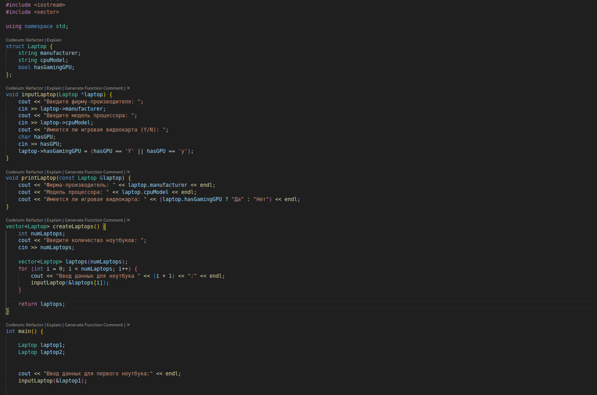
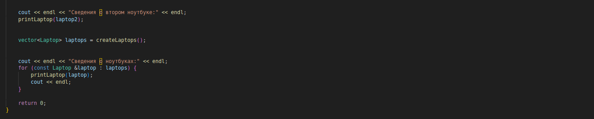
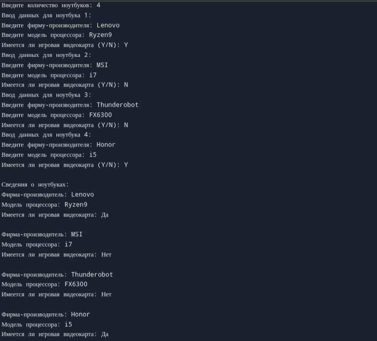

# Структуры

## Цель: знакомство с абстрактными типами данных

## Задачи:     
1. Создать по 2 экземпляра структуры
2. Создать функцию ввода структуры из консоли: параметром принимать указатель на структуру.
3. Создать функцию вывода структуры: печатает сведения о экземпляре структуры.
4. Функция, которая создает динамически экземпляры структуры, сохраняет их в вектор.
5. Функция main должна иметь псевдоменю. В зависимости от введенной цифры должны вызываться те или иные функции.

## Вариант 2

## Код программы
|||

## Результат работы программы
||

## Вывод
Узнали, как создавать и использовать структуры для хранения данных, связанных с объектом реального мира. Поняли, как использовать указатели для доступа к данным в памяти и для передачи ссылок на объекты, а также углубили понимание основных принципов ООП, таких как инкапсуляция и полиморфизм. Кроме того, решение задач на структуры помогло нам отточить наши навыки решения проблем, отладки и программирования на C++.